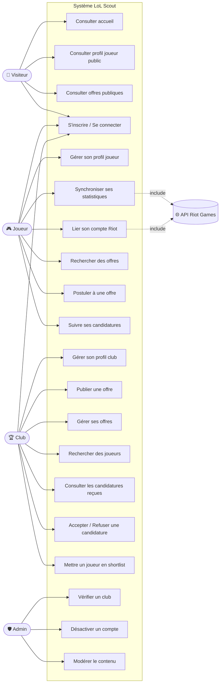
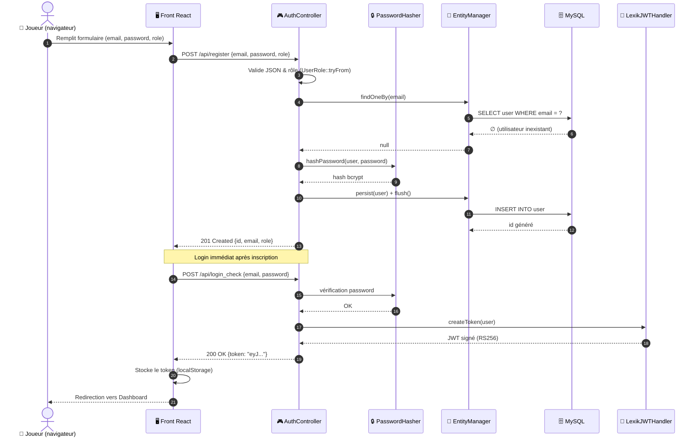
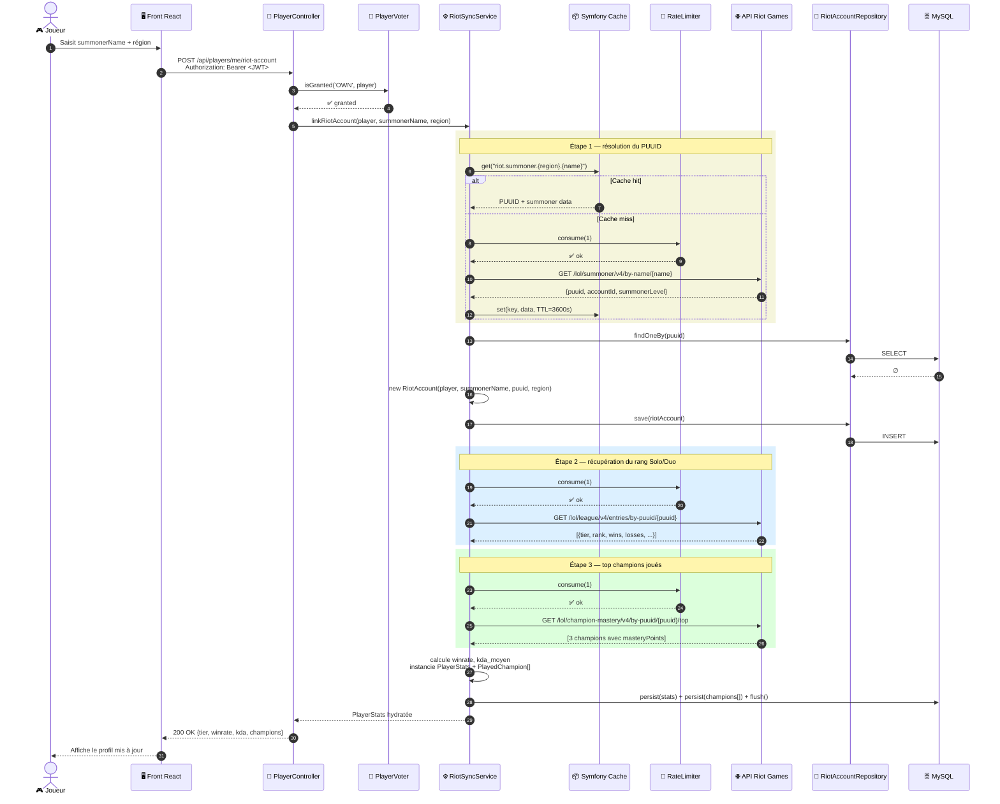
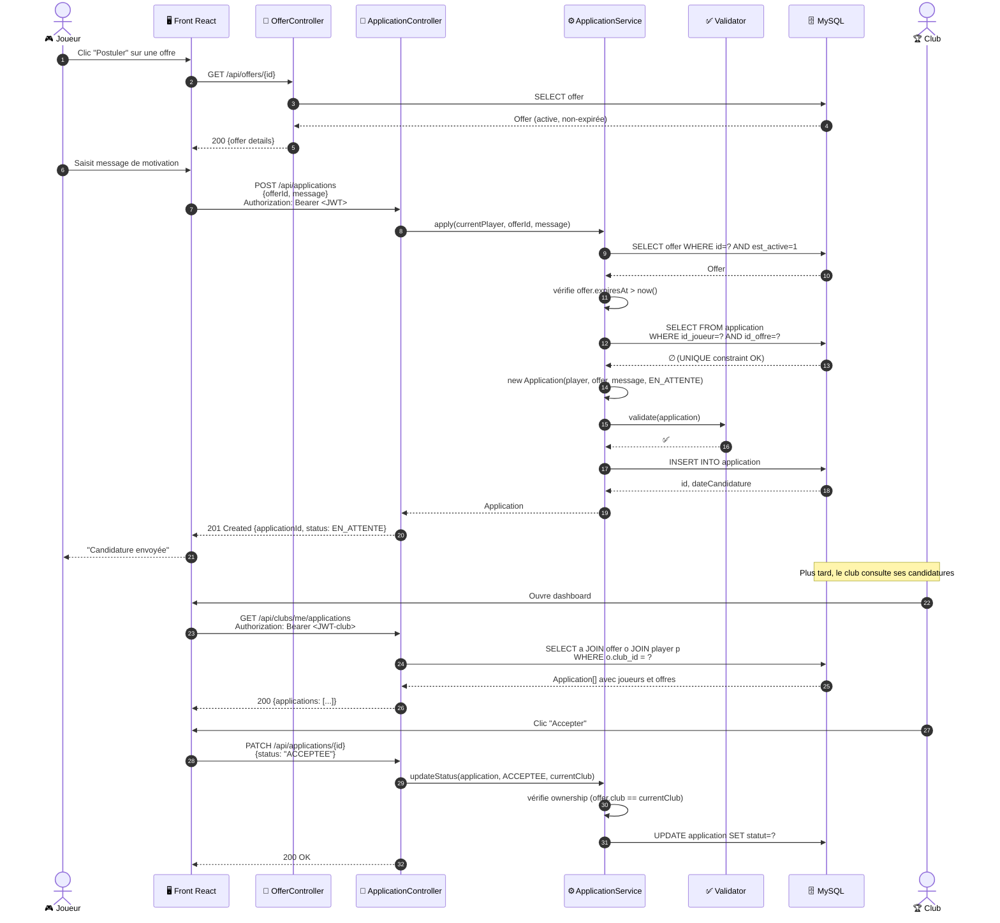
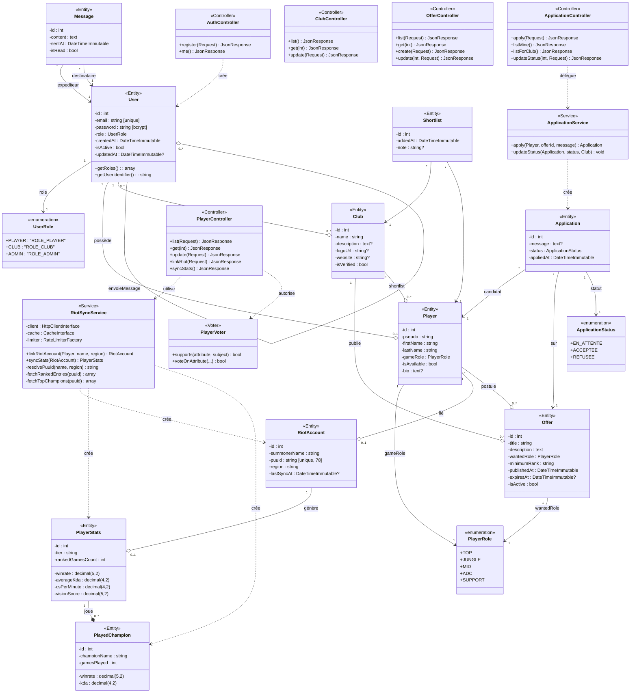
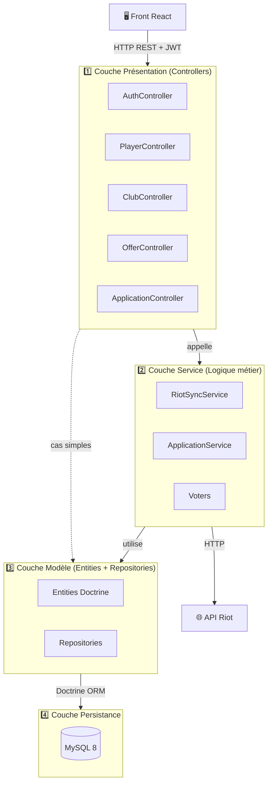
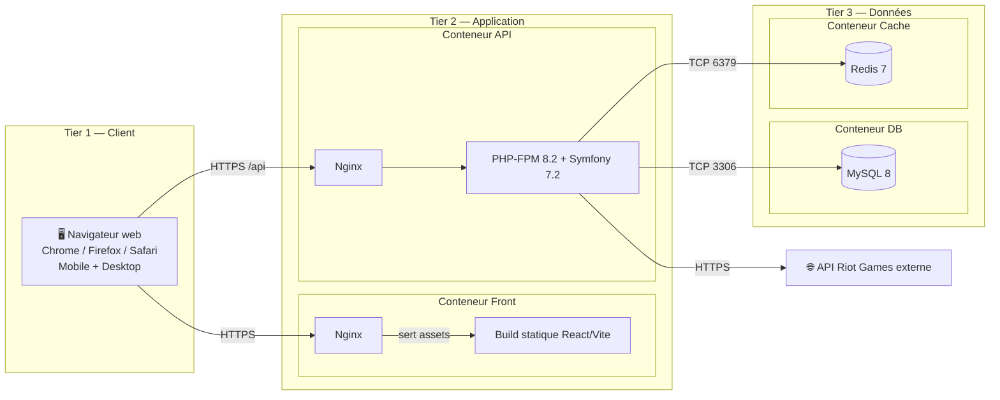
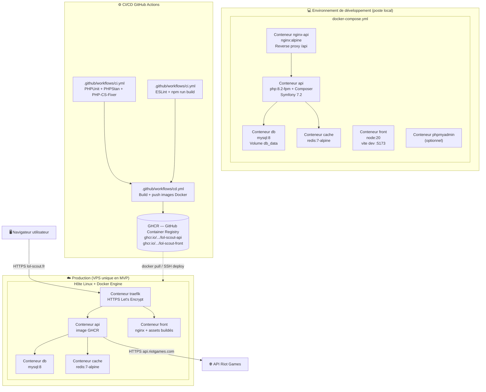

---
puppeteer:
  format: A4
  displayHeaderFooter: false
  printBackground: true
  margin:
    top: 20mm
    bottom: 20mm
    left: 18mm
    right: 18mm
---

<style>
@media print {
  h1, h2, h3, h4 {
    page-break-after: avoid;
    break-after: avoid;
    page-break-inside: avoid;
    break-inside: avoid;
  }
  h1 + *, h2 + *, h3 + *, h4 + * {
    page-break-before: avoid;
    break-before: avoid;
  }
  .mermaid, pre, table {
    page-break-inside: avoid;
    break-inside: avoid;
    page-break-before: avoid;
    break-before: avoid;
  }
  .mermaid svg, p > svg, .mume-mermaid svg {
    max-width: 100% !important;
    max-height: 70vh !important;
    width: auto !important;
    height: auto !important;
    display: block;
    margin: 0 auto;
  }
}
</style>

# PROJET FIL ROUGE – CDA

# LoL Scout

**Plateforme de recrutement esport – League of Legends**

---

## JALON 4 – Avril 2026

### Conception de l'application & Architecture technique

Diagrammes UML · Architecture multi-couches

---

| | |
|---|---|
| **Auteur** | Nassim |
| **Formation** | Concepteur Développeur d'Applications (CDA – IPSSI) |
| **Stack** | Symfony 7.2 API · React 19 + TypeScript · MySQL 8 |
| **Date de livraison** | 30/04/2026 |
| **Échéance** | Dernier jour ouvrable d'avril 2026 |

---

## Table des matières

1. [Introduction](#i-introduction)
2. [Diagrammes de cas d'utilisation](#ii-diagrammes-de-cas-dutilisation)
3. [Diagrammes de séquence](#iii-diagrammes-de-séquence)
4. [Diagramme de classes](#iv-diagramme-de-classes)
5. [Architecture multi-couches](#v-architecture-multi-couches)
6. [Schéma de déploiement](#vi-schéma-de-déploiement)
7. [Conclusion](#vii-conclusion)

---

## I. Introduction

Ce document constitue le livrable du **Jalon 4** du projet fil rouge LoL Scout. Il poursuit la trajectoire amorcée au Jalon 1 (CDCF), Jalon 2 (méthodologie et UI/UX) et Jalon 3 (modélisation MERISE de la base de données) en passant à la **conception logicielle** : modélisation UML de l'application et description de son architecture technique.

L'objectif est de produire l'ensemble des diagrammes et descriptions qui guideront le développement et qui documenteront la structure interne de l'application. Concrètement, ce dossier répond à quatre questions :

- **Qui fait quoi ?** → diagrammes de cas d'utilisation
- **Comment ça se passe à l'exécution ?** → diagrammes de séquence
- **Comment le code est structuré ?** → diagramme de classes
- **Comment l'application est déployée et organisée en couches ?** → description d'architecture

Le développement back-end a déjà commencé en parallèle de cette phase de conception : les entités principales (`User`, `Player`, `Club`, `Offer`, `RiotAccount`, `PlayerStats`, `PlayedChampion`), l'authentification JWT et plusieurs endpoints REST sont opérationnels. Les diagrammes ci-dessous documentent l'architecture cible de l'application.

---

## II. Diagrammes de cas d'utilisation

### 2.1 Acteurs identifiés

Quatre acteurs interagissent avec le système, dérivés du CDCF (Jalon 1) :

| Acteur | Rôle Symfony | Description |
|---|---|---|
| **Visiteur** | (anonyme) | Internaute non authentifié. Consultation publique uniquement. |
| **Joueur** | `ROLE_PLAYER` | Joueur LoL Diamond+ qui se met en vitrine et candidate. |
| **Club** | `ROLE_CLUB` | Structure esport qui recrute (publie offres, consulte profils). |
| **Administrateur** | `ROLE_ADMIN` | Modère la plateforme, vérifie les clubs, gère les utilisateurs. |

Le rôle est porté par l'entité `User` via l'enum `UserRole`. L'API Riot Games est un **système externe** sollicité par le back-end.

### 2.2 Diagramme de cas d'utilisation global



> **Légende** : les flèches en pointillés `include` signalent qu'un cas d'utilisation **inclut systématiquement** un appel à l'API Riot Games externe.

### 2.3 Détail par acteur

#### 2.3.1 Joueur (`ROLE_PLAYER`)

| ID | Cas d'utilisation | Description courte |
|---|---|---|
| UC10 | Gérer son profil joueur | Créer/modifier pseudo, prénom, nom, rôle de jeu, disponibilité, bio |
| UC11 | Lier son compte Riot | Saisir son `summonerName` + région ; le back-end appelle Riot pour obtenir le `puuid` |
| UC12 | Synchroniser ses statistiques | Déclenche un appel Riot pour récupérer rang, winrate, KDA, vision, champions joués |
| UC13 | Rechercher des offres | Filtrer par rôle, rang minimum, club, statut |
| UC14 | Postuler à une offre | Envoyer une candidature avec message de motivation |
| UC15 | Suivre ses candidatures | Voir le statut (en attente, acceptée, refusée) |

#### 2.3.2 Club (`ROLE_CLUB`)

| ID | Cas d'utilisation | Description courte |
|---|---|---|
| UC20 | Gérer son profil club | Nom, description, logo, site web |
| UC21 | Publier une offre | Titre, description, rôle recherché, rang minimum, date d'expiration |
| UC22 | Gérer ses offres | Lister, modifier, désactiver |
| UC23 | Rechercher des joueurs | Filtrer par rôle, rang, disponibilité |
| UC24 | Consulter les candidatures reçues | Lister les candidatures par offre |
| UC25 | Accepter / Refuser une candidature | Mettre à jour le statut |
| UC26 | Mettre un joueur en shortlist | Ajouter un joueur aux favoris avec note privée |

#### 2.3.3 Administrateur (`ROLE_ADMIN`)

| ID | Cas d'utilisation | Description courte |
|---|---|---|
| UC30 | Vérifier un club | Passer `est_verifie = true` après contrôle |
| UC31 | Désactiver un compte | Soft-delete via `est_actif = false` |
| UC32 | Modérer le contenu | Supprimer offres ou messages problématiques |

### 2.4 Couverture du périmètre MVP

Le tableau suivant trace chaque fonctionnalité du CDCF (Jalon 1, §V) vers ses cas d'utilisation :

| Fonctionnalité MVP (CDCF) | Use Cases couverts |
|---|---|
| Inscription/connexion (joueur, club) | UC4 |
| Création/consultation profil joueur | UC10, UC2 |
| Liaison compte joueur ↔ API Riot | UC11 |
| Affichage stats principales (rang, rôle, winrate) | UC12, UC2 |
| Recherche simple par rôle/rang | UC13, UC23 |
| Publication d'offres (clubs) | UC21 |
| Système de candidature | UC14, UC15, UC24, UC25 |

Toutes les fonctionnalités MVP du Jalon 1 sont représentées par au moins un cas d'utilisation. Les fonctionnalités hors-MVP du CDCF (messagerie, comparaison détaillée, dashboard avancé) sont volontairement omises de ce diagramme, conformément au périmètre défini par le CDCF.

---

## III. Diagrammes de séquence

Trois scénarios principaux sont détaillés. Ils ont été choisis pour illustrer chacune des trois zones de complexité du système : **authentification**, **intégration externe** (Riot Games) et **flux métier** transversal (candidature).

### 3.1 Scénario 1 — Inscription d'un joueur et génération du JWT

**Cas d'utilisation couvert** : UC4 (S'inscrire / Se connecter).



**Points clés** :
- La route `/api/login_check` est gérée automatiquement par le **firewall Symfony Security** (configuration `security.yaml`), pas par notre `AuthController`.
- Le token JWT est signé avec une **clé privée RSA** (`config/jwt/private.pem`) ; le front ne peut pas le forger.
- Le front stocke le token et l'injecte dans l'en-tête `Authorization: Bearer <token>` pour toutes les requêtes suivantes via un **intercepteur Axios**.
- Les mots de passe sont hashés en **bcrypt** ; ils ne sont jamais stockés en clair ni renvoyés au front (jamais dans les groupes de sérialisation `*:read`).

### 3.2 Scénario 2 — Liaison du compte Riot et synchronisation des statistiques

**Cas d'utilisation couvert** : UC11 + UC12 (lier compte Riot + sync stats). Ce scénario est central : il met en évidence l'intégration de l'API Riot Games avec **rate-limiting** et **cache** (contrainte CDCF §VI).



**Points clés** :
- Le cache Symfony (driver Redis ou filesystem en dev) évite de re-consommer le quota Riot pour des résolutions répétées de PUUID. **TTL** : 1h pour la résolution summoner, 5min pour les stats classées.
- Le rate-limiter (`symfony/rate-limiter`) respecte les quotas Riot (20 req / 1s, 100 req / 2min en dev key) — il bloque proprement avec une `RateLimitExceededException` traduite en `429 Too Many Requests` côté API.
- En cas d'**échec Riot** (timeout, 503, key expirée), le service lève une exception captée par un `ExceptionListener` qui renvoie une réponse JSON normalisée et **ne corrompt pas la BDD** (transaction rollback).

### 3.3 Scénario 3 — Candidature d'un joueur à une offre

**Cas d'utilisation couvert** : UC14 (Postuler) + UC25 (Accepter/Refuser côté club).



**Points clés** :
- La contrainte d'unicité `UNIQUE(id_joueur, id_offre)` (Jalon 3 §V) empêche les doubles candidatures au niveau de la BDD.
- L'autorisation est vérifiée par un **Voter Symfony** : seul le club propriétaire de l'offre peut changer le statut d'une candidature.
- Une fonctionnalité de **notification** (email, in-app) est volontairement écartée du MVP — la BDD prévoit déjà la table `message` pour la post-MVP.

---

## IV. Diagramme de classes

Le diagramme ci-dessous représente la structure orientée objet du back-end. Il regroupe trois packages logiques :
- **Controllers** : points d'entrée HTTP (REST)
- **Services** : logique métier
- **Entities** : modèle Doctrine (mapping ORM ↔ MySQL)



### 4.1 Mapping MERISE → Doctrine

Le diagramme de classes reprend fidèlement le MLD du Jalon 3, avec quelques **renommages côté code** pour suivre les conventions Symfony (anglais, camelCase) :

| Table MERISE (Jalon 3) | Classe Doctrine | Notes |
|---|---|---|
| `utilisateur` | `User` | implémente `UserInterface` Symfony Security |
| `joueur` | `Player` | `pseudo` reste, `prenom→firstName`, `nom→lastName`, `role_jeu→gameRole`, `disponibilite→isAvailable` |
| `compte_riot` | `RiotAccount` | `summoner_name→summonerName`, `date_sync→lastSyncAt` |
| `stats_joueur` | `PlayerStats` | `rang→tier`, `kda_moyen→averageKda`, `cs_par_minute→csPerMinute`, `vision_score→visionScore`, `nb_parties→rankedGamesCount` |
| `champion_joue` | `PlayedChampion` | `nom_champion→championName`, `nb_parties→gamesPlayed` |
| `club` | `Club` | `nom→name`, `logo_url→logoUrl`, `site_web→website`, `est_verifie→isVerified` |
| `offre` | `Offer` | `titre→title`, `role_recherche→wantedRole`, `rang_minimum→minimumRank`, `date_publication→publishedAt`, `date_expiration→expiresAt`, `est_active→isActive` |
| `candidature` | `Application` | `statut→status`, `date_candidature→appliedAt` |
| `message` | `Message` | post-MVP, schéma anticipé |
| `shortlist` | `Shortlist` | post-MVP, schéma anticipé |

### 4.2 Patterns de conception utilisés

- **Repository Pattern** (Doctrine) : un `XxxRepository` par entité, encapsule les requêtes (`findByRoleAndRank`, `findActiveByClub`…).
- **Service Layer** : la logique métier est extraite des controllers vers `RiotSyncService`, `ApplicationService` (Single Responsibility).
- **Voter Pattern** (Symfony Security) : `PlayerVoter`, `ClubVoter`, `OfferVoter` centralisent les règles d'autorisation.
- **DTO / Serializer Groups** : pour ne jamais exposer le hash bcrypt (`User::password` n'est dans aucun groupe `*:read`).
- **Strategy** : `RankComparator` implémente une stratégie de comparaison de rangs LoL (Iron < Bronze < … < Challenger) utilisée par la recherche d'offres et de joueurs.

---

## V. Architecture multi-couches

### 5.1 Architecture logique en couches (back-end)

L'application back-end suit une **architecture en 4 couches** classique, dérivée du pattern **MVC** étendu par une couche service explicite :



| Couche | Responsabilité | Composants Symfony |
|---|---|---|
| **Présentation** | Recevoir HTTP, valider, sérialiser JSON | Controllers, Serializer, Validator |
| **Service** | Logique métier, orchestration, autorisation | Services (`src/Service/`), Voters |
| **Modèle** | Représentation du domaine, requêtes BDD | Entités Doctrine, Repositories |
| **Persistance** | Stockage relationnel | MySQL via Doctrine ORM |

> **Note importante** : il n'y a pas de couche **Vue** côté Symfony — l'API renvoie du **JSON** uniquement. La vue est portée par l'application **React** indépendante. Symfony joue ici le rôle de **Modèle + Contrôleur** dans un MVC distribué entre back et front.

### 5.2 Architecture n-tiers (déploiement physique)

Le système est déployé en **3 tiers physiques distincts**, chacun conteneurisé pour la production :



**Distinction couche logique vs tier physique** :

| Couche logique | Tier physique |
|---|---|
| Vue (React) | Tier 1 (navigateur) + serveur statique en Tier 2 |
| Présentation (Controllers) | Tier 2 |
| Service (Métier) | Tier 2 |
| Modèle (Entités, Repos) | Tier 2 |
| Persistance | Tier 3 |

L'architecture reste **logiquement n-tier** même si l'on déploie tous les conteneurs sur **un seul VPS** en MVP (cas d'étude). Le découplage permet de scaler horizontalement (plusieurs instances PHP-FPM derrière un load-balancer) sans changer le code.

### 5.3 Pattern MVC en pratique

LoL Scout applique **MVC distribué** :

- **Modèle** = entités Doctrine + repositories (côté Symfony).
- **Vue** = application React (côté front, indépendamment déployée).
- **Contrôleur** = controllers Symfony, qui orchestrent la requête HTTP.

Côté Symfony, les **controllers sont volontairement minces** :

```php
// PlayerController::syncStats — simplifié
#[Route('/api/players/me/sync', methods: ['POST'])]
public function syncStats(RiotSyncService $svc): JsonResponse
{
    /** @var User $user */
    $user = $this->getUser();
    $stats = $svc->syncForUser($user); // toute la logique métier dans le service
    return $this->json($stats, 200, [], ['groups' => ['stats:read']]);
}
```

La **logique métier** (appels Riot, cache, rate-limit, calculs) est encapsulée dans `RiotSyncService` — le controller ne fait que valider la requête, déléguer, sérialiser la réponse.

### 5.4 Séparation des responsabilités — principes SOLID

| Principe | Application |
|---|---|
| **S** — Single Responsibility | Une classe = une responsabilité. `AuthController` gère uniquement l'inscription. `RiotSyncService` gère uniquement la sync Riot. Le hashing est confié à `UserPasswordHasherInterface` de Symfony. |
| **O** — Open/Closed | Les enums `UserRole` et `PlayerRole` peuvent être étendus sans toucher aux entités. Les Voters Symfony permettent d'ajouter de nouvelles règles d'autorisation sans modifier les controllers. |
| **L** — Liskov | `User` implémente `UserInterface` et `PasswordAuthenticatedUserInterface` — tout consommateur Symfony Security l'utilise sans connaître les détails. |
| **I** — Interface Segregation | Le code dépend de petites interfaces (`HttpClientInterface`, `CacheInterface`) plutôt que de classes concrètes. |
| **D** — Dependency Inversion | Les dépendances sont injectées par le constructeur (autowiring Symfony). Aucun `new` direct dans la logique métier. |

**Bonnes pratiques additionnelles** :
- **Configuration sensible** isolée dans `.env.local` (jamais commit) : clé Riot (`RIOT_API_KEY`), secret JWT, credentials DB.
- **Validation systématique** : attributs `#[Assert\NotBlank]`, `#[Assert\Length]`, `#[Assert\Url]` sur les entités, validés par le composant Validator avant persistance.
- **Sérialisation maîtrisée** : groupes `player:read` / `player:write` empêchent l'exposition accidentelle de données (notamment le hash du mot de passe).
- **Migrations versionnées** : Doctrine Migrations (`migrations/Version*.php`) — schéma reproductible en CI et prod.
- **CORS strict** : `nelmio/cors-bundle` configuré pour autoriser uniquement le domaine du front.

### 5.5 Composants externes et bibliothèques

#### Back-end Symfony

| Bundle / Lib | Version | Rôle | Couche |
|---|---|---|---|
| `symfony/framework-bundle` | 7.2 | Cœur du framework, routing, DI | Présentation |
| `doctrine/orm` + `doctrine-bundle` | 3.6 / 2.18 | ORM, mapping entités | Modèle |
| `doctrine-migrations-bundle` | 3.7 | Migrations versionnées du schéma | Persistance |
| `symfony/security-bundle` | 7.2 | Authentification, firewall, voters | Sécurité transversale |
| `lexik/jwt-authentication-bundle` | 3.2 | JWT (RS256) pour API stateless | Sécurité |
| `nelmio/cors-bundle` | 2.6 | Configuration CORS pour front React | Présentation |
| `symfony/serializer` | 7.2 | Sérialisation JSON avec groupes | Présentation |
| `symfony/validator` | 7.2 | Validation déclarative des entités | Modèle |
| `symfony/http-client` | 7.2 | Appels API Riot Games | Service |
| `symfony/cache` | 7.2 | Cache Riot (Redis ou filesystem) | Service |
| `symfony/rate-limiter` | 7.2 | Quota Riot (20/s, 100/2min) | Service |
| `symfony/maker-bundle` | 1.67 | Génération de code (entités, controllers) | Outil dev |

#### Front-end React

| Package | Rôle |
|---|---|
| `react`, `react-dom` (v19) | UI library |
| `react-router-dom` | Routing client |
| `axios` | Client HTTP avec intercepteur JWT |
| `zustand` / `@tanstack/react-query` | State management et cache serveur |
| `react-hook-form` + `zod` | Formulaires et validation |
| `eslint` + `typescript-eslint` | Lint et qualité TypeScript |
| Polices Google Fonts | Cinzel, Outfit, JetBrains Mono (charte Jalon 2) |

---

## VI. Schéma de déploiement

Le diagramme ci-dessous présente les **composants déployables** et leur **environnement d'exécution** cible, à la fois pour le **développement local** (Docker Compose) et pour la **production**.



### 6.1 Variables d'environnement clés

| Variable | Tier | Description |
|---|---|---|
| `APP_SECRET` | API | Secret applicatif Symfony |
| `DATABASE_URL` | API | DSN MySQL (`mysql://user:pass@db:3306/lolscout`) |
| `JWT_PASSPHRASE` | API | Passphrase de la clé privée RSA |
| `JWT_PUBLIC_KEY` / `JWT_SECRET_KEY` | API | Chemins vers les clés `config/jwt/*.pem` |
| `RIOT_API_KEY` | API | Clé d'accès API Riot (rotation périodique en prod) |
| `CORS_ALLOW_ORIGIN` | API | Origine autorisée du front (`https://lol-scout.fr`) |
| `REDIS_URL` | API | URL du conteneur cache (`redis://cache:6379`) |
| `VITE_API_URL` | Front | URL de l'API (`https://lol-scout.fr/api`) |

### 6.2 Stratégie de déploiement

1. **CI** déclenchée à chaque push sur `develop` et `main` :
   - back : tests PHPUnit, analyse PHPStan, conformité PHP-CS-Fixer
   - front : ESLint, build Vite (vérifie l'absence d'erreur de typage)
2. **CD** sur push `main` (Jalon 6) :
   - Build des images Docker `api` et `front`
   - Push sur **GitHub Container Registry**
   - Déclenchement d'un déploiement par SSH sur le VPS (ou Watchtower auto-pull)
3. **Migrations Doctrine** exécutées automatiquement au démarrage du conteneur API (`bin/console doctrine:migrations:migrate --no-interaction`).

---

## VII. Conclusion

Ce dossier de conception couvre les quatre dimensions exigées par le Jalon 4 :

- **Cas d'utilisation** — un diagramme global et un détail par acteur couvrant l'intégralité du périmètre fonctionnel défini au CDCF (Jalon 1).
- **Diagrammes de séquence** — trois scénarios principaux (authentification JWT, synchronisation Riot Games avec cache et rate-limiting, cycle complet de candidature) couvrant les zones de complexité de l'application.
- **Diagramme de classes** — entités Doctrine, services et controllers avec leurs relations et cardinalités, en cohérence avec le MLD du Jalon 3.
- **Architecture multi-couches** — pattern MVC distribué, architecture 3-tiers physique, application des principes SOLID, bibliothèques externes documentées.

L'architecture présentée est le résultat d'une réflexion de conception fondée sur les contraintes du CDCF (sécurité, performances, intégration externe Riot Games) et sur la modélisation MERISE du Jalon 3. Elle garantit la séparation des responsabilités, la testabilité, la maintenabilité, et est suffisamment modulaire pour accueillir les fonctionnalités post-MVP (messagerie, shortlist, statistiques avancées) sans refonte du schéma ni du code.
